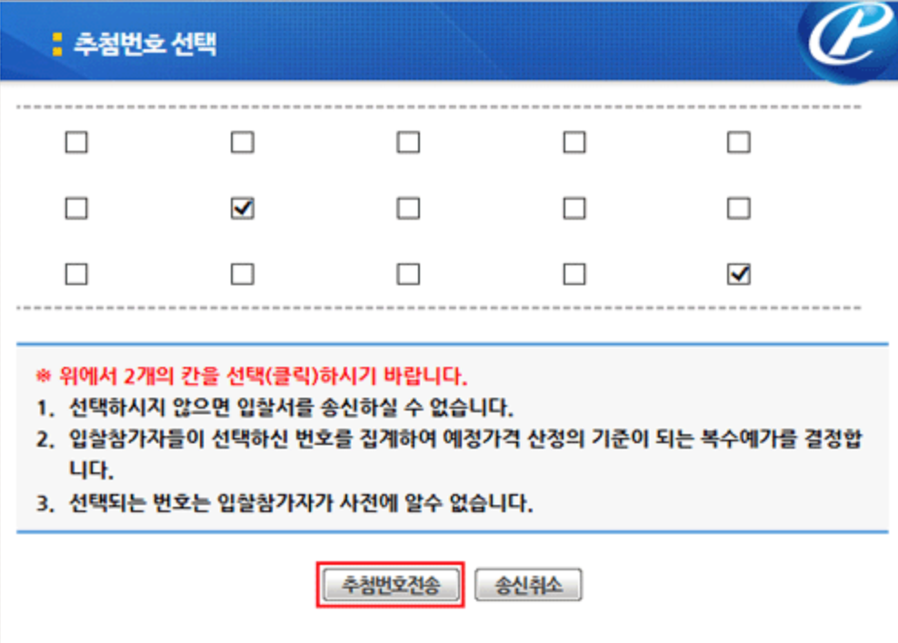
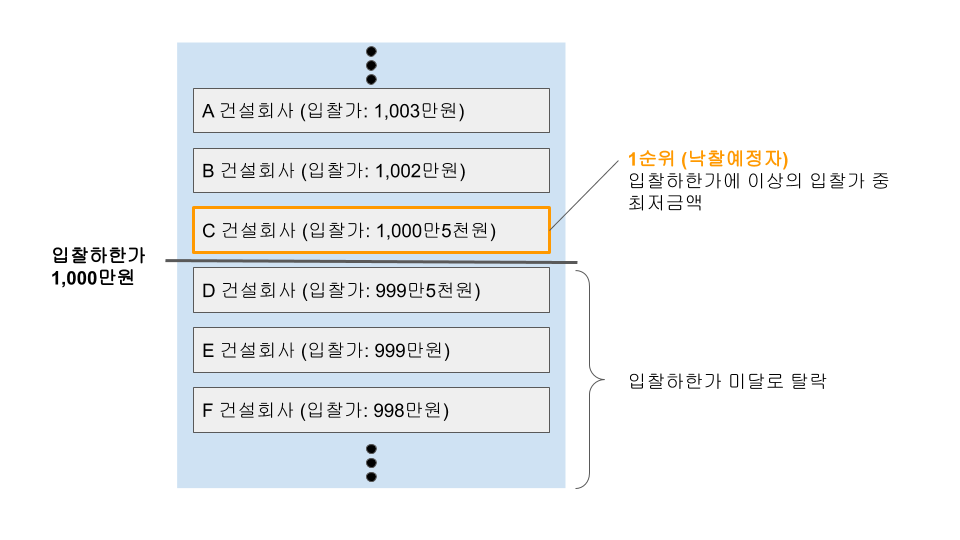

# bidding-datasets

나라장터의 입찰공고의 **예정가격**을 예측하는 프로젝트의 데이터셋입니다. 주로 **토목, 전기, 조경** 업종을 위주로 나라장터 사이트에서 크롤링하여 예측에 필요한 데이터를 수집했습니다.

- 포함된 업종: 토목, 전기, 조경 등
- 수집범위: 2018/01/01 ~ 2020/08/31
- 데이터 수: 200K+ 이상

## 프로젝트의 목표

**본 프로젝트는 `사정률` 또는 `예정가격`을 정확하게 예측하는 것입니다.**
하지만 입찰업체들은 이 예정가격이 기초가격대비 0.01% 단위오차로 1순위가 갈리기 때문에, 실제로는 예정가격보다는 `사정률` 이라는 지표를 사용하여 입찰에 활용하게 됩니다. 사정률은 **`예상예정가격 / 기초금액`** 을 의미하며, 입찰이 마감된 이후에는 사정률을 `예정가격 / 기초금액` 의 의미로도 쓰고 있습니다.

## 입찰 및 낙찰 과정에 대한 간략한 설명

1. 나라장터에 정부관련 사업으로 입찰이 공고되게 되면, 입찰을 희망하는 업체들은 입찰마감일시까지 전자입찰을 진행하게 됩니다.
1. 전자입찰시에 입찰시에는 각 업체들은 크게 **2가지의 행위**를 하게 됩니다.

   - `본인의 입찰가격 입력`: 공고의 내용과 기초금액 등을 참고하여 입찰하고자 하는 금액을 입력합니다.
   - `비공개 복수예가 15개 중 2개 선택`: 조달청은 다양한 업체에게 공정한 입찰기회를 제공하기 위해서, 입찰 참가자에게 비공개 복수예가 15개중 2개를 선택하게 하고 있습니다. 복수예가가 공개인 경우도 있지만 아주 극소수이며, 대부분의 입찰은 비공개로 복수예가 15개를 뿌린다고 보면 됩니다. 복수예가는 보통 **기초금액의 -2% ~ +2%** 또는 **기초금액의 -3% ~ +3%** 범위에서 랜덤으로 생성되며, 각 업체들은 이 중에서 2개를 선택하게 됩니다.

     

1. 입찰마감후, 개찰이 되면 **예정금액**이 공개되며, 이에 따라 1순위 낙찰예정자가 결정되게 됩니다.

- [1순위 낙찰예정자 결정방법](#입찰-1순위는-어떻게-결정되는가?)
- [예정금액 결정방법](#예정금액은-어떻게-결정되는가?)

## Dataset 설명

- `datasets/train.csv`: 2019/01/01 ~ 2020/08/31 기간동안의 입찰결과 데이터입니다. 학습 데이터로 활용하세요.
- `datasets/train.csv`: 2020/09/01 ~ 2020/09/30 기간동안의 입찰결과 데이터입니다. 테스트 데이터로 활용하세요.

| Column           | Description                                                                                                                                                                                                                                                                                          | 입찰마감전에 알 수 있는 정보인가? |
| ---------------- | ---------------------------------------------------------------------------------------------------------------------------------------------------------------------------------------------------------------------------------------------------------------------------------------------------- | --------------------------------- |
| 입찰공고번호     | 입찰공고의 고유번호입니다.                                                                                                                                                                                                                                                                           | Y                                 |
| 업무             | 어떤한 업무에 대한 입찰공고인지를 나타냅니다. 공사, 용역, 물품 등이 있습니다만, 대부분 공사나 용역입니다.                                                                                                                                                                                            | Y                                 |
| 업종코드         | 업종에 대한 코드입니다. 업종명 별로 코드가 부여되어 있습니다.                                                                                                                                                                                                                                        | Y                                 |
| 업종명           | 업종명입니다. 전기, 조경, 토목 별로 조금 세분화되어 있습니다.                                                                                                                                                                                                                                        | Y                                 |
| 재입찰번호       | 재입찰을 하는 경우 카운팅되는 번호로 보여집니다. _(본 프로젝트에서 큰 의미는 없는듯 합니다)_                                                                                                                                                                                                         | Y                                 |
| 공고명           | 공고명을 나타냅니다.                                                                                                                                                                                                                                                                                 | Y                                 |
| 공고기관         | 공고기관을 나타냅니다.                                                                                                                                                                                                                                                                               | Y                                 |
| 수요기관         | 수요기관을 나타냅니다.                                                                                                                                                                                                                                                                               | Y                                 |
| WTO품목번호      | WTO품목번호로 어떤 품목을 납품하는지를 나타내는 것 같습니다.                                                                                                                                                                                                                                         | Y                                 |
| 게시일시         | 공고가 게시된 일시입니다.                                                                                                                                                                                                                                                                            | Y                                 |
| 입찰개시일시     | 입찰이 개시되는 일시입니다.                                                                                                                                                                                                                                                                          | Y                                 |
| 입찰마감일시     | 입찰이 마감되는 일시입니다.                                                                                                                                                                                                                                                                          | Y                                 |
| 개찰일시         | 개찰이 진행되는 일시입니다. 보통 입찰마감일시와 동일한 날에 이루어집니다.                                                                                                                                                                                                                            | Y                                 |
| 예가방법         | 예가를 산출하는 방법입니다.                                                                                                                                                                                                                                                                          | Y                                 |
| 예가범위         | -2% ~ + 2% 또는 -3% ~ + 3% 중 어떤 범위에서 예가가 생성되는지를 나타냅니다.                                                                                                                                                                                                                          | Y                                 |
| 추첨번호공개여부 | 입찰업체가 예가를 2개 선택할 때, 추첨번호를 공개할 것인가 여부입니다. 거의 대부분 비공개입니다.                                                                                                                                                                                                      | Y                                 |
| 지역제한         | 입찰업체 소재지를 지역별로 제한할 것인지를 나타냅니다. 공고서 참조인 경우 공고서를 보지 않으면 지역제한 여부를 확인할 수 없습니다.                                                                                                                                                                   | Y                                 |
| 참가가능지역     | 지역제한이 **투찰제한** 으로 명시적으로 되어 있는 경우, 참가가능지역을 나타냅니다.                                                                                                                                                                                                                   | Y                                 |
| 추정가격         | 기초금액을 발표하기 전에 공고기관 및 수요기관이 시장조사를 한 바탕으로 추정가격을 발표합니다. 예정금액과의 직접적인 연관은 없는 것으로 보입니다.                                                                                                                                                     | Y                                 |
| 기초금액         | **우리의 예측목표인 예정금액과 직접적으로 관련이 있는 가장 중요한 설명변수입니다.** 이 기초금액의 예가범위 내에서 예가들이 산출되게 되고, 그 예가들에서 예정금액이 결정되게 됩니다.                                                                                                                  | Y                                 |
| A값              | 2019년8월부터 도입된 값인데, 기초금액에서 건강보험, 국민연금 등의 금액을 제외하기 위하여 도입되었습니다. **A값이 존재하는 경우 낙찰하한가 계산식이 달라지니 주의 바랍니다.**                                                                                                                         | Y                                 |
| 낙찰하한률       | 낙찰하한가를 계산하기 위한 하한률입니다. 보통 공고서에 명시적으로 포함되어 있지만 공고서가 HWP파일로 되어있어 크롤링이 불가능하여 제가 직접 계산했습니다. 따라서 완벽하게 정확하지 않을 수 있으니 주의 부탁드립니다. (87.745, 86.745 의 경우 거의 맞다고 가정하시고 그냥 쓰시면 문제 없을 듯 합니다) | Y                                 |
| 참가수           | 입찰에 참가한 업체수입니다.                                                                                                                                                                                                                                                                          | **N**                             |
| 낙찰예정자       | 1순위 낙찰예정자 입니다.                                                                                                                                                                                                                                                                             | **N**                             |
| 투찰금액         | 1순위 낙찰예정자가 입찰한 금액입니다.                                                                                                                                                                                                                                                                | **N**                             |
| 투찰률           | `투찰금액 / 예정금액` 입니다.                                                                                                                                                                                                                                                                        | **N**                             |
| 예정금액         | 예정금액을 나타냅니다. **타겟변수라고도 할 수 있겠습니다.**                                                                                                                                                                                                                                          | **N**                             |
| 사정율           | `예정금액 / 기초금액` 입니다. **타겟변수라고도 할 수 있겠습니다.**                                                                                                                                                                                                                                   | **N**                             |

## F&Q

### 예정금액은 어떻게 결정되는가?

예정금액은 입찰업체가 선택한 복수예가들 중 **가장 많이 선택된 4개의 예가의 산술평균**입니다.

### 입찰 1순위는 어떻게 결정되는가?

개찰결과로 예정가격이 공개되면, 예정가격과 낙찰하한률에 따른 `입찰하한가`가 결정됩니다. 아래 그림과 같이, **입찰하한가보다 높은 금액으로 입찰한 업체 중에서, 가장 입찰하한가에 근접한 업체가 1순위 낙찰예정자로 선정**되게 됩니다. 다만, 입찰결과들을 보면 알겠지만 정말 입찰하한가와 근소한 차이로 1순위로 선정되기도 하며, 미달이 되어 떨어지기도 합니다. 입찰하한가에 근접했으나, 0.001%의 오차로 아쉽게 입찰하한가 미달로 탈락되기도 합니다.

